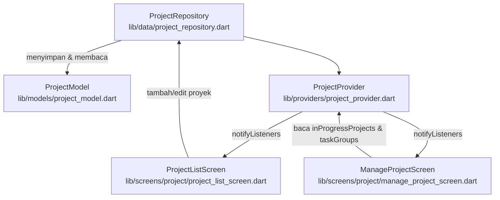
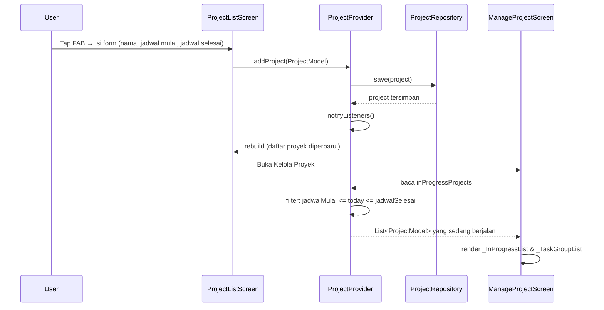
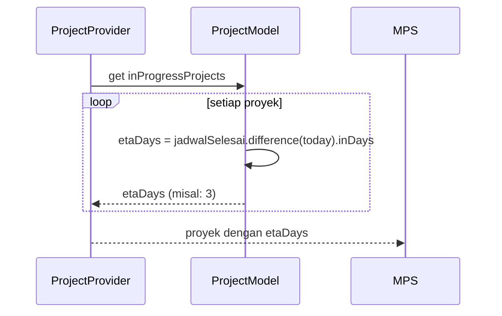

# Design Document: Kelola Proyek – In Progress dari Daftar Proyek

## Overview

Saat ini, bagian "In Progress" dan "Task Groups" di layar **Kelola Proyek** (`ManageProjectScreen`) menggunakan data hardcoded. Fitur ini menghubungkan kedua layar sehingga:

1. **Daftar Proyek** menjadi sumber data tunggal (*single source of truth*) untuk semua proyek.
2. Proyek yang memiliki jadwal (*tanggal mulai* dan *tanggal selesai*) dan sedang berjalan hari ini secara otomatis muncul di bagian "In Progress" pada Kelola Proyek.
3. Setiap proyek yang aktif juga muncul sebagai **Task Group** di Kelola Proyek, sehingga pengguna dapat melacak progres tugas per proyek.

---

## Architecture



Arsitektur menggunakan pola **Provider + Repository**:
- `ProjectModel` — model data proyek yang dapat dibagikan antar layar.
- `ProjectRepository` — lapisan data (in-memory untuk sekarang, mudah diganti ke API/DB).
- `ProjectProvider` — `ChangeNotifier` yang menjadi jembatan antara repository dan UI.
- Kedua layar (`ProjectListScreen` dan `ManageProjectScreen`) mengonsumsi `ProjectProvider` yang sama.

---

## Sequence Diagrams

### Alur: Tambah Proyek dengan Jadwal → Muncul di In Progress



### Alur: Hitung ETA (sisa hari)



---

## Components and Interfaces

### 1. ProjectModel

**Tujuan**: Model data proyek yang digunakan bersama oleh Daftar Proyek dan Kelola Proyek.

**Interface**:
```dart
class ProjectModel {
  final String id;
  final String title;
  final String client;
  final String status;       // 'On Track' | 'Revisi' | 'Urgent'
  final double progress;     // 0.0 – 1.0
  final String imagePath;
  final int nilaiProject;    // dalam rupiah
  final DateTime jadwalMulai;
  final DateTime jadwalSelesai;
  final List<String> taskIds; // ID tugas yang terkait

  bool get isInProgress {
    final today = DateTime.now();
    final d = DateTime(today.year, today.month, today.day);
    final mulai = DateTime(jadwalMulai.year, jadwalMulai.month, jadwalMulai.day);
    final selesai = DateTime(jadwalSelesai.year, jadwalSelesai.month, jadwalSelesai.day);
    return !d.isBefore(mulai) && !d.isAfter(selesai);
  }

  int get etaDays {
    final today = DateTime.now();
    final d = DateTime(today.year, today.month, today.day);
    final selesai = DateTime(jadwalSelesai.year, jadwalSelesai.month, jadwalSelesai.day);
    return selesai.difference(d).inDays;
  }
}
```

**Tanggung Jawab**:
- Menyimpan semua atribut proyek termasuk jadwal.
- Menyediakan computed property `isInProgress` dan `etaDays`.
- Immutable (gunakan `copyWith` untuk update).

---

### 2. ProjectRepository

**Tujuan**: Lapisan abstraksi data. Saat ini in-memory; dapat diganti dengan Supabase/API.

**Interface**:
```dart
abstract class ProjectRepository {
  List<ProjectModel> getAll();
  void add(ProjectModel project);
  void update(ProjectModel project);
  void delete(String id);
}

class InMemoryProjectRepository implements ProjectRepository {
  final List<ProjectModel> _projects = [..._seedData];
  // implementasi...
}
```

---

### 3. ProjectProvider

**Tujuan**: `ChangeNotifier` yang mengekspos data proyek ke UI dan menyediakan filter "In Progress".

**Interface**:
```dart
class ProjectProvider extends ChangeNotifier {
  final ProjectRepository _repo;

  List<ProjectModel> get allProjects;
  List<ProjectModel> get inProgressProjects; // filter isInProgress == true
  List<ProjectModel> get taskGroups;         // alias inProgressProjects (untuk Task Groups)

  void addProject(ProjectModel p);
  void updateProject(ProjectModel p);
  void deleteProject(String id);
}
```

**Tanggung Jawab**:
- Menjadi satu-satunya sumber data untuk kedua layar.
- Filter `inProgressProjects` dihitung secara reaktif setiap kali data berubah.

---

### 4. ManageProjectScreen (diperbarui)

**Tujuan**: Menampilkan In Progress dan Task Groups dari `ProjectProvider`.

**Perubahan**:
- Ubah dari `StatelessWidget` menjadi `StatefulWidget` atau gunakan `Consumer<ProjectProvider>`.
- `_InProgressList` membaca `provider.inProgressProjects`.
- `_TaskGroupList` membaca `provider.taskGroups`.
- `_SectionHeader` count dihitung dari panjang list, bukan hardcoded.

---

### 5. ProjectListScreen (diperbarui)

**Tujuan**: Menampilkan semua proyek dan menyediakan form tambah proyek dengan jadwal.

**Perubahan**:
- Ganti `List<_Project>` lokal dengan `provider.allProjects`.
- FAB membuka `AddProjectSheet` yang memiliki field `jadwalMulai` dan `jadwalSelesai`.
- Setelah simpan, memanggil `provider.addProject(...)`.

---

## Data Models

### ProjectModel

```dart
class ProjectModel {
  final String id;
  final String title;
  final String client;
  final String status;
  final double progress;
  final String imagePath;
  final int nilaiProject;
  final DateTime jadwalMulai;
  final DateTime jadwalSelesai;
  final List<String> taskIds;
}
```

**Aturan Validasi**:
- `title` tidak boleh kosong.
- `jadwalMulai` harus sebelum atau sama dengan `jadwalSelesai`.
- `progress` harus dalam rentang `0.0` – `1.0`.
- `nilaiProject` harus ≥ 0.
- `id` unik (gunakan `uuid` atau timestamp).

---

## Key Functions with Formal Specifications

### `isInProgress` (computed getter)

```dart
bool get isInProgress
```

**Preconditions**:
- `jadwalMulai` dan `jadwalSelesai` adalah `DateTime` yang valid.
- `jadwalMulai` ≤ `jadwalSelesai`.

**Postconditions**:
- Mengembalikan `true` jika dan hanya jika `jadwalMulai` ≤ today ≤ `jadwalSelesai` (perbandingan tanggal saja, tanpa waktu).
- Tidak mengubah state apapun.

**Loop Invariants**: N/A (tidak ada loop).

---

### `ProjectProvider.inProgressProjects`

```dart
List<ProjectModel> get inProgressProjects
```

**Preconditions**:
- `_repo.getAll()` mengembalikan list yang valid (boleh kosong).

**Postconditions**:
- Setiap elemen dalam hasil memiliki `isInProgress == true`.
- Urutan dipertahankan dari urutan asli di repository.
- Jika tidak ada proyek yang sedang berjalan, mengembalikan list kosong.

---

### `addProject`

```dart
void addProject(ProjectModel project)
```

**Preconditions**:
- `project.title` tidak kosong.
- `project.jadwalMulai` ≤ `project.jadwalSelesai`.
- `project.id` belum ada di repository.

**Postconditions**:
- Proyek tersimpan di repository.
- `notifyListeners()` dipanggil.
- Jika `project.isInProgress == true`, proyek muncul di `inProgressProjects`.

---

## Algorithmic Pseudocode

### Algoritma: Filter In Progress

```pascal
ALGORITHM getInProgressProjects(repository)
INPUT: repository berisi List<ProjectModel>
OUTPUT: List<ProjectModel> yang sedang berjalan

BEGIN
  today ← DateTime.now() tanpa komponen waktu
  result ← []

  FOR each project IN repository.getAll() DO
    mulai ← project.jadwalMulai tanpa komponen waktu
    selesai ← project.jadwalSelesai tanpa komponen waktu

    IF mulai <= today AND today <= selesai THEN
      result.add(project)
    END IF
  END FOR

  RETURN result
END
```

**Loop Invariant**: Semua elemen dalam `result` memiliki jadwal yang mencakup `today`.

---

### Algoritma: Hitung ETA Label

```pascal
ALGORITHM computeEtaLabel(project)
INPUT: project dengan jadwalSelesai
OUTPUT: String label ETA

BEGIN
  today ← DateTime.now() tanpa komponen waktu
  selesai ← project.jadwalSelesai tanpa komponen waktu
  days ← selesai.difference(today).inDays

  IF days < 0 THEN
    RETURN 'Terlambat'
  ELSE IF days == 0 THEN
    RETURN 'Hari ini'
  ELSE IF days == 1 THEN
    RETURN '1 hari lagi'
  ELSE
    RETURN '$days hari lagi'
  END IF
END
```

---

### Algoritma: Tambah Proyek dari Form

```pascal
ALGORITHM addProjectFromForm(formData, provider)
INPUT: formData (title, client, jadwalMulai, jadwalSelesai, nilaiProject)
OUTPUT: void (side effect: proyek tersimpan)

BEGIN
  // Validasi
  IF formData.title IS EMPTY THEN
    SHOW error 'Nama proyek wajib diisi'
    RETURN
  END IF

  IF formData.jadwalMulai > formData.jadwalSelesai THEN
    SHOW error 'Jadwal mulai harus sebelum jadwal selesai'
    RETURN
  END IF

  // Buat model
  project ← ProjectModel(
    id: generateUniqueId(),
    title: formData.title,
    client: formData.client,
    jadwalMulai: formData.jadwalMulai,
    jadwalSelesai: formData.jadwalSelesai,
    nilaiProject: formData.nilaiProject,
    status: 'On Track',
    progress: 0.0,
    taskIds: []
  )

  // Simpan
  provider.addProject(project)
  CLOSE form sheet
END
```

---

## Example Usage

```dart
// 1. Setup provider di main.dart / widget tree
MultiProvider(
  providers: [
    ChangeNotifierProvider(
      create: (_) => ProjectProvider(InMemoryProjectRepository()),
    ),
  ],
  child: const MyApp(),
)

// 2. Di ManageProjectScreen — baca In Progress
Consumer<ProjectProvider>(
  builder: (context, provider, _) {
    final inProgress = provider.inProgressProjects;
    return _InProgressList(projects: inProgress);
  },
)

// 3. Di ProjectListScreen — tambah proyek
void _onSave(BuildContext context) {
  final provider = context.read<ProjectProvider>();
  provider.addProject(ProjectModel(
    id: DateTime.now().millisecondsSinceEpoch.toString(),
    title: _titleC.text,
    client: _clientC.text,
    jadwalMulai: _jadwalMulai!,
    jadwalSelesai: _jadwalSelesai!,
    nilaiProject: int.parse(_nilaiC.text),
    status: 'On Track',
    progress: 0.0,
    imagePath: 'assets/images/rucas.jpg',
    taskIds: [],
  ));
  Navigator.pop(context);
}

// 4. Cek apakah proyek sedang berjalan
final project = ProjectModel(...);
if (project.isInProgress) {
  // tampilkan di In Progress
}

// 5. Hitung ETA
final eta = project.etaDays; // misal: 3
final label = eta <= 0 ? 'Hari ini' : '$eta hari lagi';
```

---

## Error Handling

### Skenario 1: Jadwal Mulai Setelah Jadwal Selesai

**Kondisi**: User mengisi `jadwalMulai` > `jadwalSelesai` di form.
**Respons**: Tampilkan pesan error inline di bawah field jadwal selesai.
**Pemulihan**: User memperbaiki tanggal sebelum bisa menyimpan.

### Skenario 2: Tidak Ada Proyek In Progress

**Kondisi**: Tidak ada proyek yang jadwalnya mencakup hari ini.
**Respons**: Tampilkan empty state di bagian "In Progress" dengan teks "Tidak ada proyek yang sedang berjalan".
**Pemulihan**: User menambah proyek baru dengan jadwal yang mencakup hari ini.

### Skenario 3: Proyek Tanpa Jadwal (Data Lama)

**Kondisi**: Data proyek lama tidak memiliki `jadwalMulai`/`jadwalSelesai`.
**Respons**: Proyek tidak muncul di In Progress (default `isInProgress = false`).
**Pemulihan**: User dapat mengedit proyek untuk menambahkan jadwal.

---

## Testing Strategy

### Unit Testing

- `ProjectModel.isInProgress` — uji dengan berbagai kombinasi tanggal (sebelum, selama, sesudah).
- `ProjectModel.etaDays` — uji dengan tanggal yang sudah lewat, hari ini, dan masa depan.
- `ProjectProvider.inProgressProjects` — uji filter dengan campuran proyek aktif dan tidak aktif.
- `addProject` validasi — uji dengan input tidak valid (judul kosong, jadwal terbalik).

### Property-Based Testing

**Library**: `dart_test` dengan `package:test`

**Properti yang diuji**:
- Untuk semua proyek `p` dengan `jadwalMulai <= today <= jadwalSelesai`, `p.isInProgress == true`.
- Untuk semua proyek `p` dengan `jadwalSelesai < today`, `p.isInProgress == false`.
- `inProgressProjects` selalu merupakan subset dari `allProjects`.
- Menambah proyek yang `isInProgress == true` selalu menambah panjang `inProgressProjects` sebesar 1.

### Integration Testing

- Tambah proyek dengan jadwal aktif di `ProjectListScreen` → verifikasi muncul di `ManageProjectScreen` bagian In Progress.
- Tambah proyek dengan jadwal masa depan → verifikasi tidak muncul di In Progress.
- Tambah proyek → verifikasi Task Group baru muncul di Kelola Proyek.

---

## Performance Considerations

- Filter `inProgressProjects` berjalan di O(n) setiap kali `notifyListeners()` dipanggil. Untuk jumlah proyek yang wajar (< 1000), ini tidak menjadi masalah.
- Jika data proyek berasal dari API, pertimbangkan caching dan lazy loading.
- `DateTime.now()` dipanggil setiap kali getter diakses — dapat di-cache per frame jika diperlukan.

---

## Security Considerations

- Validasi input di sisi client (form) sebelum menyimpan ke repository.
- `id` proyek harus unik; gunakan UUID atau timestamp untuk menghindari tabrakan.
- Jika data disimpan ke backend, tambahkan validasi server-side untuk `jadwalMulai` ≤ `jadwalSelesai`.

---

## Dependencies

| Dependency | Kegunaan |
|---|---|
| `provider` (sudah ada) | State management — `ChangeNotifier` |
| `go_router` (sudah ada) | Navigasi antar layar |
| `flutter/material.dart` | UI components |
| `intl` (opsional) | Format tanggal yang lebih baik (misal: "2 Jan 2026") |

Tidak ada dependency baru yang wajib ditambahkan. `provider` perlu ditambahkan ke `pubspec.yaml` jika belum ada.
